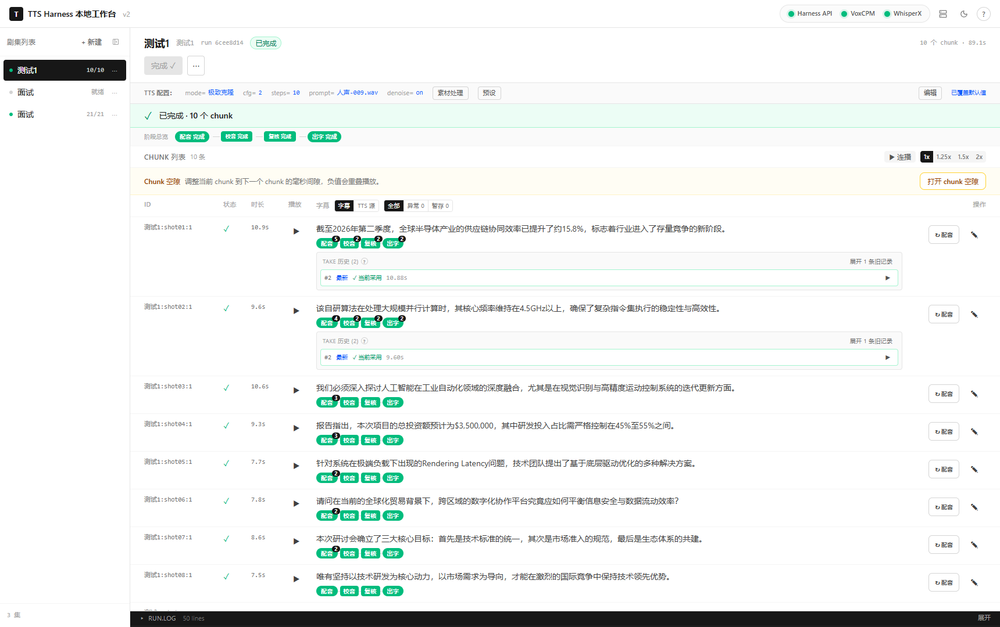
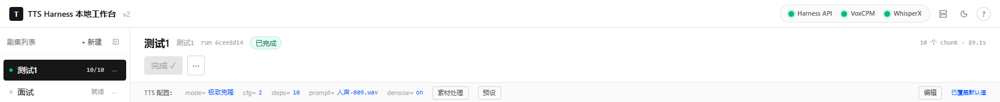
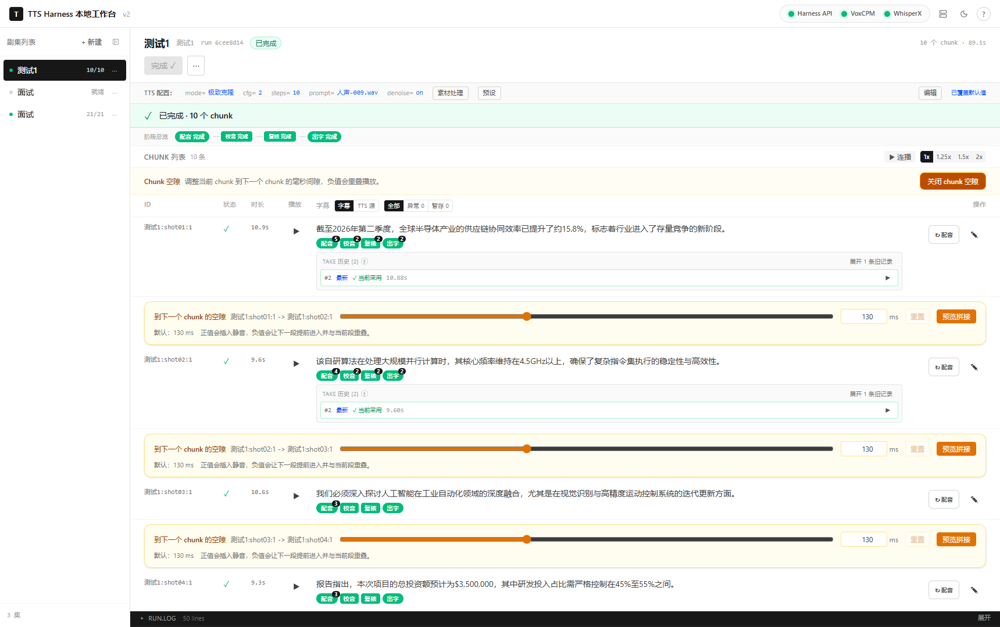
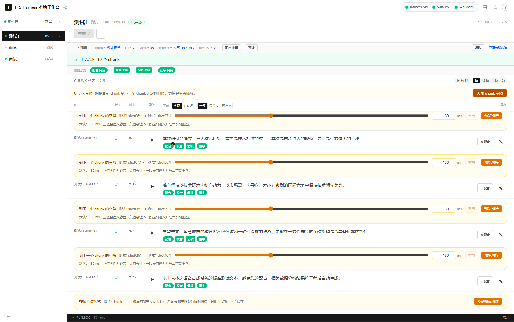
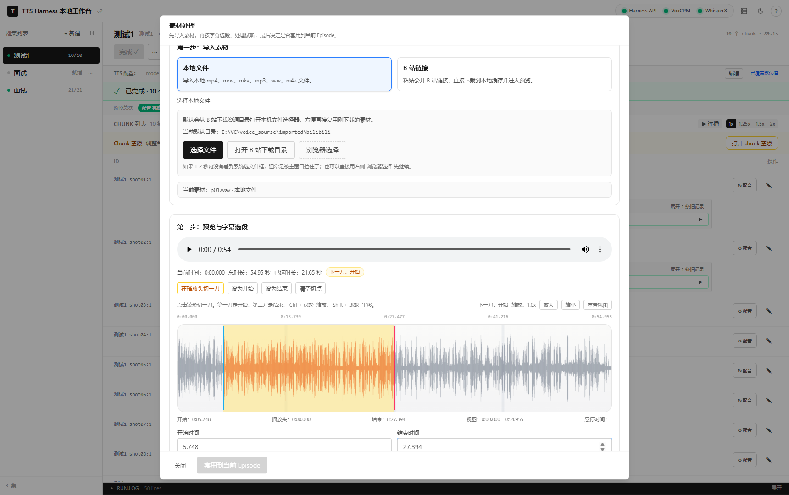
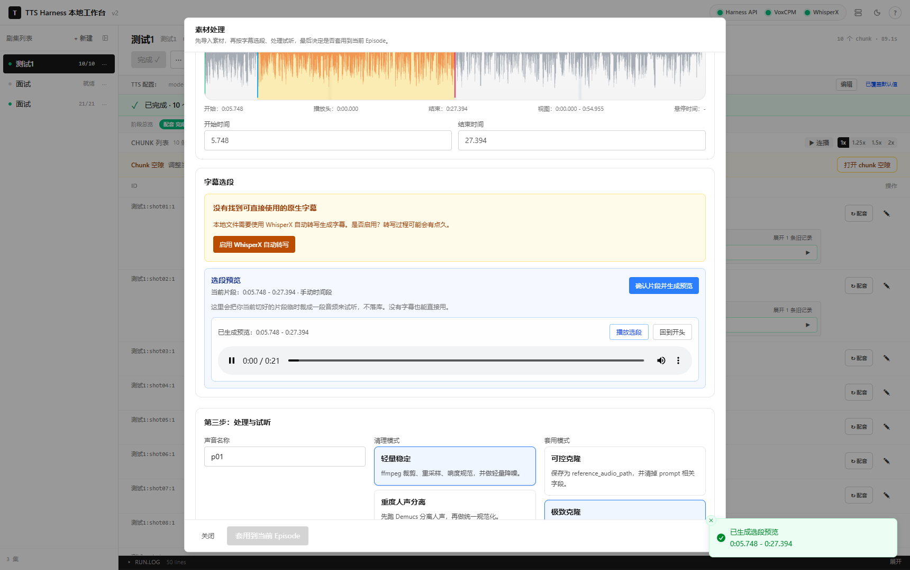

# TTS VoxCPM2 Agent Harness

> 一个本地优先的中文 TTS 生产工作台。  
> 把脚本、纯文本、B 站链接或本地音视频素材，变成可审听、可返工、可导出的配音、字幕和 Remotion 时间轴素材。

## 项目定位

这个仓库面向 Windows 本地工作流，默认使用：

- 本地 `VoxCPM2` 进行语音合成
- 本地 `WhisperX` 进行字幕解析、转写和复核
- 本地 `FastAPI + Next.js` 提供工作台
- `PostgreSQL + MinIO + Prefect` 负责任务编排和产物管理

如果你希望把“生成配音”做成一条可重复、可人工干预、可导出的完整链路，这个项目就是为这个目标设计的。

## 功能亮点

| 能力 | 说明 |
| --- | --- |
| 本地 TTS 工作流 | 支持 `声音设计 / 可控克隆 / 极致克隆` 三种模式 |
| 素材处理 | 支持本地 `mp4 / mov / mkv / mp3 / wav / m4a`，也支持 B 站公开视频导入 |
| 字幕与选段 | 优先使用 B 站原生字幕；没有原生字幕时可启用 WhisperX 自动转写 |
| 波形切段 | 第二步支持波形预览、切点选择、`Ctrl + 滚轮` 缩放、`Shift + 滚轮` 平移 |
| 选段预览 | 选好片段后可直接生成临时预览音频，不落库 |
| Chunk 工作台 | 支持按 chunk 返工、take 历史、人工复核、批量处理 |
| Chunk 空隙编辑 | 支持调节 chunk 与下一个 chunk 之间的间隙，支持负值重叠和拼接预览 |
| 导出能力 | 可导出 `shot*.wav`、整集 `episode.wav`、字幕、durations 和 Remotion manifest |

## 界面截图

### 1. 主工作台与服务状态

展示 episode、TTS 配置、阶段状态、chunk 列表，以及 Harness API / VoxCPM / WhisperX 的本地服务可用状态。





### 2. Chunk 空隙编辑

可以直接调整 chunk 与下一个 chunk 的拼接间隙，支持正值静音、负值重叠和边界预览。



### 3. 整体拼接预览

打开 chunk 空隙后，底部可以临时预览整集拼接效果，不写入数据库，方便快速听整体节奏。



### 4. 素材处理与波形切段

支持导入本地音视频或 B 站素材，在第二步里用波形切点、缩放和平移来精修选段。



### 5. 选段预览与处理试听

切好开始和结束点后，可以先生成临时选段预览，确认没有截断句子，再继续做降噪、分离或克隆配置。



## 系统架构

```text
Browser
  -> Next.js Web (:3010)
  -> FastAPI API (:8100)
      -> Prefect tasks
      -> PostgreSQL + MinIO
      -> local voxcpm-svc (:8877)
      -> local whisperx-svc (:7860)
```

前端阶段标签与后端流程大致对应：

| 阶段 | 中文标签 | 含义 |
| --- | --- | --- |
| `P1` | 切稿 | 脚本切分 |
| `P1c` | 初检 | 初步校验 |
| `P2` | 配音 | 语音合成 |
| `P2c` | 校音 | 音频检查 |
| `P2v` | 复核 | ASR 复核 |
| `P5` | 出字 | 字幕生成 |
| `P6` | 拼轨 | 整集音频拼接 |
| `P6v` | 总检 | 最终校验 |

## 快速开始

### 1. 准备环境

先安装这些软件：

- Docker Desktop
- Python `3.12`
- Node.js `18+`
- `pnpm`
- `ffmpeg` 和 `ffprobe`

### 2. 克隆仓库并准备 `.env`

```powershell
git clone https://github.com/JsirCool/TTS-Voxcpm2-agent.git
cd TTS-Voxcpm2-agent
copy .env.dev .env
```

### 3. 安装依赖

推荐使用统一的 Python 虚拟环境：

```powershell
python -m venv .venv
.\.venv\Scripts\python.exe -m pip install --upgrade pip
.\.venv\Scripts\python.exe -m pip install -e .\server[dev]
.\.venv\Scripts\python.exe -m pip install -e .\voxcpm-svc
.\.venv\Scripts\python.exe -m pip install -e .\whisperx-svc[dev]
pnpm --dir .\web install
```

### 4. 检查本地配置

至少确认这些值可用：

- `VENV_PY`
- `VOXCPM_MODEL_PATH`
- `HF_HOME`
- `VOXCPM_URL`
- `WHISPERX_URL`
- `NEXT_PUBLIC_API_URL`

如果你的机器不走代理，建议清空或删除：

- `HTTP_PROXY`
- `HTTPS_PROXY`

### 5. 启动整套本地服务

```powershell
.\start-local-stack.bat
```

启动脚本会自动：

- 启动 Docker 基础设施
- 执行数据库迁移
- 启动 VoxCPM、WhisperX、API、Web
- 打开工作台页面

默认地址：

```text
http://localhost:3010
```

关闭服务：

```powershell
.\stop-local-stack.bat
```

如果你想看到服务窗口和日志，使用调试启动：

```powershell
.\start-local-stack-debug.bat
```

更详细的 Windows 说明见 [WINDOWS-START.md](WINDOWS-START.md)。

## 常用目录约定

推荐目录结构：

```text
E:\VC\tts-agent-harness
E:\VC\voice_sourse
```

项目里保留了历史目录名 `voice_sourse` 这一拼写，用来兼容现有本地数据。

重要目录：

- 仓库根目录：`E:\VC\tts-agent-harness`
- 声音素材目录：`E:\VC\voice_sourse`
- B 站导入目录：`E:\VC\voice_sourse\imported\bilibili`
- 处理后的声音资产：`voice_sourse/assets/<voice-name>/`

参考音频路径会优先按相对路径保存，并从 `voice_sourse` 下解析。

## 素材处理工作流

在前端 `TTS 配置` 附近打开 `素材处理`。

支持输入：

- 本地文件：`mp4`、`mov`、`mkv`、`mp3`、`wav`、`m4a`
- B 站公开链接：`bilibili.com/video/BV...`、`bilibili.com/video/av...`、`b23.tv/...`

典型流程：

1. 导入本地文件，或粘贴 B 站链接。
2. 在第二步里预览音频/视频并查看波形。
3. 用波形切段或字幕选段确定开始和结束位置。
4. 点击“确认片段并生成预览”，试听切好的片段。
5. 命名声音素材并选择清理模式。
6. 试听原始片段、处理后素材和固定试配音。
7. 满意后再应用到当前 Episode。

第二步的波形编辑器支持：

- 点击波形切点
- 第一刀作为开始，第二刀作为结束
- `Ctrl + 滚轮` 缩放
- `Shift + 滚轮` 平移
- 在播放头位置切一刀
- 生成切好片段的临时预览音频

字幕策略：

- B 站视频优先使用原生字幕
- 没有原生字幕时，可手动启用 WhisperX 自动转写
- WhisperX 自动识别语言，不做翻译

当前 B 站导入限制：

- 仅支持公开视频
- 不支持登录 Cookie
- 不支持会员、付费或受保护内容
- 不支持直播
- 不支持收藏夹、合集和批量导入

## Chunk 工作台与拼接

### Chunk 空隙编辑

Chunk 列表支持打开“chunk 空隙”面板。每个 chunk 都可以控制它与下一个 chunk 的间隙：

- 字段名：`nextGapMs`
- 默认值：`130ms`
- 正值：插入静音
- 负值：让下一段提前进入，与当前段尾部重叠

支持的能力：

- 滑条拖动
- 数字输入
- 重置为默认 gap
- 当前边界拼接预览
- 整体拼接预览

这些 gap 设置不会触发重新 TTS，只影响：

- 最终拼接
- 整体预览
- 导出产物

### 返工与复核

工作台还支持：

- 按 chunk 单独重跑
- take 历史保留
- 人工确认复核
- 批量处理失败 chunk

## 三种 TTS 模式

| 模式 | 适合场景 | 关键字段 |
| --- | --- | --- |
| `声音设计 / Voice Design` | 不给参考音频，只靠文字描述生成音色 | `control_prompt` |
| `可控克隆 / Controllable Cloning` | 保留某个人的音色，同时控制语气和风格 | `reference_audio_path`，可选 `control_prompt` |
| `极致克隆 / Ultimate Cloning` | 给一段前文音频和精确文本，让模型延续式复现 | `prompt_audio_path`、`prompt_text` |

合成前会做参数互斥清理：

- `声音设计` 会清理音频参考字段
- `可控克隆` 会清理 `prompt_audio_path` 和 `prompt_text`
- `极致克隆` 会清理 `reference_audio_path` 和 `control_prompt`

对于 `极致克隆`，最重要的是 `prompt_audio_path` 与 `prompt_text` 的精确对齐。  
素材处理弹窗里的 `15s` 是推荐长度，`40s` 是硬上限。

## 新建 Episode

目前支持两种输入方式：

1. 上传 `script.json`
2. 直接粘贴文本，由前端自动转换成内部 JSON

最小脚本格式示例：

```json
{
  "title": "Episode Title",
  "segments": [
    { "id": 1, "type": "hook", "text": "第一段旁白。" },
    { "id": 2, "type": "content", "text": "第二段旁白。" }
  ]
}
```

系统会先按 `segment` 切分，再进一步拆成更小的 `chunk` 进入配音工作流。

## 导出格式

导出结果会同时包含按 shot 拆分的音频，以及整集拼接后的音频和字幕：

```text
episode.zip/
  shot01.wav
  shot02.wav
  ...
  episode.wav
  episode.srt
  subtitles.json
  durations.json
  remotion-manifest.json
```

其中：

- `episode.wav` 为最终整集拼接结果
- `durations.json` 包含时长与起止信息
- `remotion-manifest.json` 包含 shot 顺序、起止时间、音频文件名和字幕 cues，便于 Remotion 直接消费

前端也支持导出到本地目录。

## 常用地址

| 服务 | 地址 |
| --- | --- |
| Web | `http://localhost:3010` |
| API | `http://localhost:8100` |
| API 文档 | `http://localhost:8100/docs` |
| VoxCPM 健康检查 | `http://127.0.0.1:8877/healthz` |
| WhisperX 健康检查 | `http://127.0.0.1:7860/healthz` |
| MinIO 控制台 | `http://localhost:59001` |
| Prefect | `http://localhost:54200` |

## 常用命令

运行后端测试：

```powershell
.\.venv\Scripts\python.exe -m pytest .\server\tests -q
```

检查前端类型：

```powershell
pnpm --dir .\web exec tsc --noEmit
```

检查 API 状态：

```powershell
curl http://127.0.0.1:8100/healthz
curl http://127.0.0.1:8100/readyz
```

## 常见问题

| 现象 | 建议检查 |
| --- | --- |
| Web 能打开，但 Episode 加载失败 | 先检查 `http://127.0.0.1:8100/healthz` 是否可达 |
| VoxCPM 合成报错 | 核对当前 TTS 模式是否和字段匹配，尤其是 `极致克隆` 的 `prompt_text` |
| WhisperX 转写很慢 | 长音频是正常现象，界面会先确认再启动转写 |
| B 站导入失败 | 当前仅支持公开视频，不支持私密、付费、会员、登录可见内容 |
| 浏览器打不开新资源 | 可先强制刷新 `Ctrl + F5`，再检查前端服务是否已重启 |

## Desktop Portable Mode

仓库也包含了一个适合 Windows 的 Docker-free 桌面模式。

桌面模式的核心变化：

- 数据库改为本地 `SQLite`
- 对象存储改为本地文件目录
- 编排改为本地进程内执行，不依赖 `Prefect Server`

本地仍然需要准备：

- `VoxCPM2` 模型目录
- `WhisperX / Hugging Face` 缓存目录
- `voice_sourse` 参考音频目录

桌面模式入口：

- `start-desktop-stack.bat`
- `start-desktop-stack-debug.bat`
- `stop-desktop-stack.bat`
- `desktop/launcher.py`

桌面运行数据默认放在：

```text
.desktop-runtime/
  logs/
  data/
  storage/
```

桌面配置默认放在：

```text
.desktop/desktop.env
```

常用命令：

```powershell
python .\desktop\launcher.py
.\desktop\build-launcher.ps1
.\desktop\build-portable.ps1
```

### 桌面模式最少配置

最少准备 3 个路径即可：

1. `VOXCPM_MODEL_PATH`
2. `HF_HOME`
3. `HARNESS_VOICE_SOURCE_DIR`

推荐目录结构：

```text
E:\VC\
  tts-agent-harness\
  pretrained_models\
    VoxCPM2\
  hf-cache\
  voice_sourse\
```

对应关系：

- `VOXCPM_MODEL_PATH = E:\VC\pretrained_models\VoxCPM2`
- `HF_HOME = E:\VC\hf-cache`
- `HARNESS_VOICE_SOURCE_DIR = E:\VC\voice_sourse`

配置模板：

- 模板文件：`desktop/desktop.env.example`
- 实际运行文件：`.desktop/desktop.env`

两种最省事的启动方式：

1. 运行 `python .\desktop\launcher.py`，在界面里选择路径并保存。
2. 复制模板后手动修改：

```powershell
mkdir .desktop
copy .\desktop\desktop.env.example .\.desktop\desktop.env
```

建议首次使用按这个顺序：

1. 准备好 `VoxCPM2` 模型目录
2. 准备好 `WhisperX / HF` 缓存目录
3. 准备好 `voice_sourse` 目录
4. 运行 `python .\desktop\launcher.py`
5. 在启动器里保存路径
6. 点击“启动全部”
7. 等待浏览器打开 `http://127.0.0.1:3010`

## Git 仓库里不应该提交什么

这个仓库只保存源码、脚本、配置模板和文档，不应提交本地运行资产。

请不要把这些内容推到 GitHub：

- Python 虚拟环境，例如 `E:\VC\venv312`
- Hugging Face / WhisperX 缓存，例如 `E:\VC\hf-cache`
- VoxCPM2 模型文件，例如 `E:\VC\pretrained_models\VoxCPM2`
- `voice_sourse` 下的本地参考音频
- 日志、对象存储镜像、导出缓存、`node_modules`、前端构建产物

## 第三方说明

仓库内包含从 `Bili23 Downloader` 派生的最小 B 站导入逻辑。详细信息见：

- [third_party/bili23/NOTICE.md](third_party/bili23/NOTICE.md)

由于集成了这部分来源，仓库按 GPL-3.0 兼容方式分发。

## License

GPL-3.0
